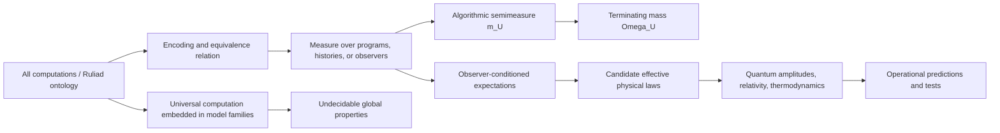

# Research: Chaitin, the Ruliad, and the Foundations of Physics

**Date:** 2026-07-14 (last updated 2026-07-14)

**Author:** OpenAI Codex

**Status:** Complete

## Executive Summary

There is a real connection between Gregory Chaitin’s work and Stephen Wolfram’s Ruliad,
but it is narrower and more technically conditional than a general claim that the two
theories are equivalent.

The direct connection is documented by Wolfram himself.
In *The Concept of the Ruliad*, he asks about the density of terminal states in a
Turing-machine version of the Ruliad and says that the corresponding density of halting
machines and initial conditions is “essentially given by Chaitin’s Ω.” He immediately
qualifies the point: Ω cannot simply be computed, and any empirical sampling depends on
how an observer chooses and weights rules and initial conditions.
This is the most important explicit bridge between the projects.
It is not an inference imposed on them from outside.

**Algorithmic information theory (AIT)** makes the bridge precise.
For a fixed universal prefix-free machine \(U\), the algorithmic output semimeasure and
halting probability are

$$ m_U(x)=\sum_{p:U(p)=x}2^{-|p|}, \qquad \Omega_U=\sum_{p:U(p)\downarrow}2^{-|p|}. $$

Thus Ω is the total prefix-code weight of the terminating sector of an all-program
ensemble. If a computational universe is generated by sampling self-delimiting programs
with probability \(2^{-|p|}\), Ω is both the probability that the sampled program
eventually halts and the normalizing constant for outputs conditional on halting.
This is an exact mathematical result.

It does **not** yet provide a canonical measure on the Ruliad.
Ω depends on the choice of universal machine and code.
There is no uniform probability distribution over all finite programs, and Wolfram’s
Ruliad includes all computations rather than only a prefix-free language sampled by fair
coin flips. The key unsolved question is therefore not whether an Ω-like quantity can be
defined—it can—but whether the physical theory selects a privileged encoding, measure,
or invariant equivalence class that yields observer-independent predictions.
Calling the choice an observer’s reference frame describes the dependence; it does not
by itself remove it.

The deeper common structure is a tension between a simple total description and
irreducibly difficult local facts.
“All possible computations” can have a short metadescription even though questions about
individual histories can be undecidable, and the boundary between terminating and
nonterminating histories can encode an algorithmically random real such as Ω. A compact
theory can therefore coexist with unboundedly complex or uncomputable consequences.
This is a substantive lesson for foundations of physics, although it does not show that
our universe is a Ruliad or that physical constants contain Ω.

The quantum and black-hole connections divide into different evidential classes:

| Proposed connection | Assessment |
| --- | --- |
| Ruliad terminal density and an Ω-like halting weight | Explicit and mathematically natural after a measure and code are fixed |
| All computational histories and algorithmic probability | Established formal construction, but not a unique physical measure |
| Computational irreducibility and undecidability in physical models | Strong family resemblance; rigorous undecidability exists for specific dynamical and many-body problems |
| Multiway histories and Everettian or path-integral quantum descriptions | Suggestive structural analogy; no independent derivation of complex amplitudes, interference, or the Born rule follows from Ω |
| Observer-relative coarse-graining and quantum observer frameworks | Productive comparison; relational quantum mechanics, decoherence, quantum Darwinism, and first-person algorithmic theories are better-developed nearby programs |
| Ω and black-hole entropy | No established identity; they are different mathematical objects and different meanings of “information” |
| Computational inaccessibility and black-hole information recovery | Important mainstream connection, but it concerns decoding or circuit complexity, not Turing uncomputability in the usual models |
| Black holes as hypercomputers that reveal Ω | Logically studied in idealized relativistic spacetimes, but not an accepted physical possibility |
| The Ruliad as a subsumption of mathematics and physics | A coherent research proposal and metaphysical picture, not a demonstrated physical theory |

The most relevant independent research does not establish the full Ruliad, but it shows
that several parts of this territory are scientifically serious:

- Jürgen Schmidhuber’s algorithmic theories of everything explicitly assign priors to
  computable universes, exposing the same measure and typicality problems.
- Markus Müller’s “law without law” and algorithmic idealism programs use universal
  induction over first-person observer states.
  They obtain formal results in a simple bit-string model while acknowledging that a
  future theory must still derive genuine quantum features such as Bell correlations,
  no-signalling, and quantum computational structure.
- Wojciech Zurek, Rolf Landauer, and Charles Bennett connect algorithmic information,
  thermodynamic entropy, measurement records, erasure, and reversible computation.
- Cristopher Moore, Toby Cubitt and collaborators, and others prove undecidability or
  uncomputability for carefully specified physical model families.
- Modern black-hole theory relates entropy, entanglement, holographic quantum error
  correction, the Page curve, and computational decoding difficulty.
  These are mainstream information-theoretic results, but none identifies black-hole
  entropy with Chaitin’s Ω.

The disciplined conclusion is that Ω is best treated as a **boundary and measure
obstruction** for all-computation theories, not as a known physical constant.
The Ruliad supplies a broad ontology of possible computations; algorithmic information
theory supplies rigorous tools for weighting descriptions and proving limits on what can
be predicted from them.
Physics still has to supply the operational bridge: why this measure, why these
observables, why quantum amplitudes, and which predictions can distinguish the
construction from existing theories.

## 1. Scope and Evidence Standard

This report extends two prior research briefs:

- [The Ruliad: Formal Foundations, Physical Claims, and Epistemic Limits](research-2026-07-13-ruliad-foundations.md)
- [Gregory Chaitin: Algorithmic Information Theory, Ω, Diophantine Encodings, and Metabiology](research-2026-07-13-gregory-chaitin-ait-omega-metabiology.md)

The [research report index](README.md) provides the collection’s reading order and
maintenance conventions.

Those reports cover the internal histories of the Ruliad and Chaitin’s work.
The present report asks a narrower comparative question: which links among them, quantum
foundations, black holes, and physical information are exact; which are proposals; and
which are only analogies?

Four evidence levels are used throughout:

1. **Established result:** a theorem, experimentally supported physical result, or
   standard mathematical construction under explicit assumptions.
2. **Research proposal:** a technically articulated framework with unresolved steps
   between its premises and accepted physics.
3. **Productive analogy:** a structural resemblance that generates testable or
   formalizable questions but is not itself evidence of physical identity.
4. **Speculation:** a possible interpretation without a known derivation or
   discriminating observation.

This hierarchy matters because the word *information* is used for several inequivalent
quantities. Moving between them without an explicit theorem is the main source of false
connections in this area.

## 2. A Vocabulary of Information and Complexity

The following notions should not be treated as synonyms.

| Notion | What it measures | Depends on | Typical use here |
| --- | --- | --- | --- |
| Shannon entropy \(H(X)\) | Average uncertainty of a random variable | Probability distribution | Communication and classical statistical ensembles |
| von Neumann entropy \(S(\rho)\) | Mixedness or entanglement entropy of a quantum state | Density operator and subsystem split | Quantum information and black holes |
| Boltzmann or thermodynamic entropy | Logarithm of compatible microstates, with physical units | Coarse-graining and macroscopic constraints | Statistical mechanics and black-hole thermodynamics |
| Kolmogorov complexity \(K_U(x)\) | Length of the shortest program producing an individual object | Universal description language, up to an additive constant | Chaitin’s algorithmic information theory |
| Algorithmic probability \(m_U(x)\) | Total prefix weight of programs producing an output | Prefix-free universal machine and code | Universal induction and all-program ensembles |
| Chaitin’s \(\Omega_U\) | Total prefix weight of halting programs | Prefix-free universal machine and code | Halting boundary and algorithmic randomness |
| Computational complexity | Time, memory, circuit size, or another resource needed to solve or construct | Model of computation and error tolerance | Prediction, decoding, and quantum-state preparation |
| Computational irreducibility | Absence of a substantially shorter predictive computation | Precise task, resource bound, and model | Wolfram’s proposed source of apparent laws and limits |
| Physical information capacity | Number of reliably distinguishable physical states | Energy, volume, time, gravity, and operational protocol | Landauer bounds, holography, and black holes |

Two examples show why the distinctions are decisive.

First, a reversible computable bijection \(f\), with a computable inverse, preserves
Kolmogorov complexity up to a machine-dependent constant:

$$ K(f(x))=K(x)+O(1). $$

Yet a subsystem’s thermodynamic or von Neumann entropy can increase because an observer
ignores correlations with an environment.
Microscopic conservation and macroscopic information loss are therefore compatible.

Second, a quantum state generated for a very long time by a short Hamiltonian can have a
concise algorithmic description—“apply this Hamiltonian for time \(t\)”—while requiring
an enormous circuit to prepare from a chosen reference state.
Algorithmic description length and circuit complexity answer different questions.

## 3. The Documented Chaitin–Wolfram Connection

### 3.1 A long intellectual relationship

The overlap is neither accidental nor recent.
Wolfram dedicated his essay
[“Some Modern Perspectives on the Quest for Ultimate Knowledge”](https://www.stephenwolfram.com/publications/some-modern-perspectives-quest-ultimate-knowledge/)
to Chaitin on Chaitin’s sixtieth birthday and described decades of discussions with him.
The essay presents computational irreducibility as a limit on prediction and knowledge
and connects computation with fundamental physics.

Chaitin, for his part, explicitly placed his work near Wolfram’s. In
[“Epistemology as Information Theory”](https://arxiv.org/abs/math/0506552), he related
algorithmic information and Ω to digital philosophy, Edward Fredkin, and Wolfram.
In [“From Philosophy to Program Size”](https://arxiv.org/abs/math/0303352), he discussed
theoretical computer science, theoretical physics, *A New Kind of Science*, and the
possibility of characterizing life through information.
These are intellectual links, not proofs that the resulting physical programs coincide.

### 3.2 Wolfram’s explicit Ω statement

The clearest technical link appears in Wolfram’s
[“The Concept of the Ruliad”](https://wolframinstitute.org/output/the-concept-of-the-ruliad).
The Ruliad is intended to include the entangled limit of all possible computations.
When Wolfram considers terminal convergence in this structure, he compares it to a
spacelike singularity or black-hole-like endpoint.
In a Turing-machine construction, he asks for the density of machines and initial
conditions that halt and writes that this is “essentially given by Chaitin’s Ω.”

The surrounding qualifications are as important as the sentence:

- Ω is not computable.
- One can only investigate finite samples or restricted classes.
- A result depends on how programs, rules, and initial conditions are represented and
  sampled.
- Wolfram interprets such choices as part of the observer’s reference frame in the
  Ruliad.

The claim is therefore best reconstructed as follows:

> After choosing a computational presentation and a probability measure, the weight of
> the terminating part of an all-computation ensemble is an Ω-like halting probability.

That statement is mathematically sound.
A stronger claim—there is one presentation-independent numerical Ω of the Ruliad—does
not follow.

### 3.3 The Physics Project is broader than the Ω analogy

Wolfram’s Physics Project uses hypergraph rewriting and multiway systems rather than a
single prefix-free Turing machine.
Its central proposals are that causal invariance, computational boundedness, and
large-scale limits can yield relativity and quantum mechanics.
The main technical presentations include Wolfram’s
[“A Class of Models with the Potential to Represent Fundamental Physics”](https://doi.org/10.25088/ComplexSystems.29.2.107),
Jonathan Gorard’s treatment of [general relativity](https://arxiv.org/abs/2004.14810),
and the associated
[quantum-mechanical formalism](https://doi.org/10.25088/ComplexSystems.29.2.537).

These works develop discrete rewriting constructions and continuum-limit arguments.
They do not use Ω as a measured constant or as the source of quantum amplitudes.
Ω appears at a metalevel: it characterizes the undecidable terminating boundary of a
suitably measured ensemble of computations.

## 4. The Exact Formal Bridge: Ω as Halting Mass

### 4.1 Prefix-free programs supply a probability measure

Let \(U\) be a universal prefix-free machine.
Prefix-free means that no valid program is the prefix of another valid program.
Kraft’s inequality then guarantees

$$ \sum_{p\in\mathrm{dom}(U)}2^{-|p|}\leq 1. $$

If an infinite sequence of fair coin flips is read until it forms a complete
self-delimiting program, \(2^{-|p|}\) is the natural probability of program \(p\). The
probability that the selected program eventually halts is

$$ \Omega_U=\sum_{p:U(p)\downarrow}2^{-|p|}. $$

For every universal prefix-free \(U\), \(0<\Omega_U<1\); Ω is lower semicomputable but
not computable; and its binary expansion is Martin-Löf random.
Knowing enough leading bits solves all halting questions for programs up to a
corresponding length, subject to the precise encoding.
George Barmpalias’s [modern survey of Ω](https://arxiv.org/abs/1707.08109), whose
preprint was updated in 2026, reviews its mathematical roles beyond Chaitin’s original
philosophical presentation.

The related universal semimeasure

$$ m_U(x)=\sum_{p:U(p)=x}2^{-|p|} $$

weights an output by all programs that generate it, not merely its shortest program.
It is a **semimeasure** rather than a full probability distribution because some
programs never halt, so the total output weight can be less than one.
The coding theorem relates it to prefix complexity:

$$ -\log_2 m_U(x)=K_U(x)+O(1). $$

An all-program computational ensemble therefore comes with a rigorous family of
length-biased measures.
Ω is the total mass of its halting sector.
Conditional on eventual halting, the output distribution is \(m_U(x)/\Omega_U\).

### 4.2 What this says about the Ruliad

This construction yields three useful interpretations.

1. **Boundary:** Ω summarizes the undecidable division between terminating and
   nonterminating computational histories.
2. **Normalization:** Ω normalizes the finite-output distribution conditional on
   termination.
3. **Limit on compression:** because the bits of Ω encode independent halting facts, no
   finite theory computes them all, even though the ensemble has a short definition.

The third point captures a deep compatibility between Chaitin’s and Wolfram’s
worldviews.
A total mathematical object can be simply specified while its local facts are
computationally irreducible or uncomputable.
The richness need not be inserted as a long list of axioms; it can arise from the
consequences of universal computation.

### 4.3 Why there is no unique “Ω of everything” yet

The same formalism exposes the main obstacle.

There is no uniform probability distribution over a countably infinite set of finite
programs that assigns every program the same positive weight.
A distribution must favor some descriptions, lengths, or computational resources.
The prefix weight \(2^{-|p|}\) is natural only after a self-delimiting code and
universal machine have been chosen.

Different universal machines have different Ω numbers.
Universal algorithmic priors dominate computable measures and agree in broad asymptotic
senses, but their exact probabilities can differ.
David Wood, Peter Sunehag, and Marcus Hutter’s
[analysis of the nonequivalence of universal priors](https://arxiv.org/abs/1111.3854)
shows why the choice cannot simply be ignored.
The invariance theorem makes complexities differ by at most an additive constant; for
probabilities this becomes a multiplicative constant.
That is enough for some asymptotic results, not necessarily for exact physical
probabilities.

The Ruliad adds further choices:

- the primitive rewrite-rule language
- the encoding of rules and initial conditions
- whether histories, states, rules, or observer moments are sampled
- the weighting of program length, runtime, branching, and duplicate descriptions
- whether terminal, recurrent, and nonterminating histories are all in scope
- the equivalence relation used to identify computations with the same observable
  content

A physical theory needs either a principled answer to these choices or a theorem that
observable predictions are invariant under an admissible class of choices.
Without one, “all rules” is an ontology but not a predictive probability model.

This is the **measure problem**. It resembles the typicality problem in cosmology and
many-worlds quantum mechanics: the existence of all histories does not determine what a
typical observer should expect.

### 4.4 Computational equivalence does not imply measure equivalence

Wolfram appeals to the Principle of Computational Equivalence to argue that different
universal computational bases reach the same Ruliad, apart from changes of coordinates.
Universality does guarantee that one universal machine can emulate another with a fixed
interpreter. In algorithmic information theory, this gives the additive-constant
invariance of Kolmogorov complexity.

It does not preserve exact densities.
An interpreter can duplicate paths, change program lengths, slow runtimes, or assign
different code weights.
Even bounded additive changes in description length become multiplicative changes in
algorithmic probability.
The broader Principle of Computational Equivalence is a Wolfram research principle, not
a theorem that every natural presentation is measure-preserving.

A rigorous basis-independence result would need to specify the admissible translations
and prove an invariant appropriate to the intended physics.
Possible targets include a shared family of negligible sets, a geometry preserved up to
bounded distortion, asymptotically identical conditional predictions, or bounded ratios
between probability weights.
Until such a result exists, computational equivalence supports mutual simulation but not
a unique Ω value or unique probability law.

## 5. Computability Limits: A Necessary Hierarchy

Several kinds of limits recur in both projects, but they should be ordered carefully.

### 5.1 Computational irreducibility

Wolfram uses computational irreducibility for cases in which the most efficient way to
determine a system’s future is essentially to run the system.
This is an important research heuristic and can be formalized for particular prediction
tasks through time hierarchies, circuit lower bounds, communication complexity, or
reductions.

As a universal slogan, however, it is not one theorem.
A system can be irreducible for one observable and reducible for another; difficult in
the worst case but easy on the physical distribution of inputs; or impossible to
shortcut exactly but easy to approximate statistically.

### 5.2 Undecidability and uncomputability

A decision problem is undecidable if no total algorithm gives the correct yes/no answer
for every permitted input.
A real number is uncomputable if no algorithm can approximate it to arbitrary precision.
These claims are stronger and more precise than “hard to calculate.”
Ω is uncomputable because an algorithm for its bits would decide halting.

### 5.3 Algorithmic randomness

An infinite sequence is Martin-Löf random when it passes all effective statistical
tests, equivalently satisfying an incompressibility condition up to constants.
The binary expansion of Ω is algorithmically random.
This does not mean the bits are uncaused, physically sampled, or uniformly distributed
in every informal sense.
Randomness here is a theorem about an infinite mathematical sequence relative to an
effective test framework.

### 5.4 Resource complexity

A computable problem may still need astronomical time or memory.
Black-hole decoding and quantum circuit preparation usually live here.
Exponential-time inaccessibility does not become Turing uncomputability merely because
no realistic observer can wait long enough.

This hierarchy prevents three invalid inferences:

- deterministic dynamics do not imply practical predictability
- mathematical incompleteness does not imply quantum indeterminism
- computational inaccessibility does not imply physical information destruction

## 6. Independent Algorithmic “Theories of Everything”

The closest connections outside Wolfram’s and Chaitin’s own work are programs that
combine all computable worlds, algorithmic weighting, and observer-conditioned
prediction.

### 6.1 Schmidhuber: algorithmic universes and priors

Jürgen Schmidhuber’s
[“Algorithmic Theories of Everything”](https://arxiv.org/abs/quant-ph/0011122) considers
ensembles of computable universes and assigns algorithmic or speed-based priors.
This predates the Ruliad terminology and directly confronts a central issue: an ensemble
of all describable universes becomes predictive only after a prior and an
observer-selection rule are chosen.

The comparison is exact at the level of architecture:

| Component | Algorithmic ensemble | Ruliad framing |
| --- | --- | --- |
| Possibility space | All programs or computable universes | All possible computations |
| Weight | Algorithmic or speed prior | Observer-dependent sampling/reference frame, not yet one canonical formula |
| Observation | Condition on observer data | Computationally bounded observer samples an equivalence class |
| Central difficulty | Prior, duplicates, typicality, computability | Measure, reference frame, observer equivalence, extraction of laws |

The projects are not identical.
A prior-weighted ensemble is a probability model; the Ruliad is first described as a
total object. But Schmidhuber’s work demonstrates that the measure problem is not a
technical afterthought.
It is the step that turns mathematical plenitude into empirical expectation.

### 6.2 Müller: first-person algorithmic physics

Markus P. Müller’s
[“Law without law”](https://quantum-journal.org/papers/q-2020-07-20-301/) starts from
first-person observer states rather than an externally specified world.
Universal induction gives probabilities for the observer’s next state.
In a simple bit-string model, Müller proves that observers can asymptotically experience
an apparently simple, computable, probabilistic external world even when no external
world was postulated at the fundamental level.

This is unusually close to the Ruliad’s observer emphasis, but it is more explicit about
probability: an algorithmic semimeasure supplies the predictive rule.
A striking result is a form of “inverse Solomonoff induction”: for any computable
measure \(\mu\), there is positive probability, bounded in terms of the description
complexity of \(\mu\), that an observer’s predictions converge to \(\mu\). Simple
effective laws are favored because they have short descriptions.

Müller’s later [“Algorithmic Idealism”](https://doi.org/10.1007/s10701-026-00913-1)
develops the philosophical framework and is candid about its present limits.
The bit-string model cannot represent forgetting and does not yet derive specifically
quantum phenomena. A successor must recover more than words such as wavefunction or
complex amplitude: it must account for Bell inequality violations together with
no-signalling, or reproduce characteristic quantum computational structure.

This is a useful standard for evaluating the Ruliad.
Reconstructing quantum theory requires operational theorems, not just branching or
observer dependence.

### 6.3 Mathematical universe and digital-physics relatives

Other nearby programs include Konrad Zuse’s *Rechnender Raum*, Fredkin and Toffoli’s
[conservative logic](https://doi.org/10.1007/BF01857727), John Wheeler’s
[“it from bit”](https://cqi.inf.usi.ch/qic/wheeler.pdf), Seth Lloyd’s
[computational universe](https://doi.org/10.1103/PhysRevLett.88.237901), and Max
Tegmark’s [Mathematical Universe Hypothesis](https://arxiv.org/abs/0704.0646).

They share an information-first or mathematics-first orientation, but their claims
differ substantially.
Tegmark’s discussion is especially instructive: rather than simply embracing all
mathematical structures, he considers restricting attention to computable structures
partly because Gödelian and measure problems threaten predictivity.
The Ruliad instead includes universal computation and treats its irreducibility as
fundamental. These are contrasting responses to the same obstacle, not independent
confirmation of one another.

## 7. Algorithmic Information in Thermodynamics and Measurement

### 7.1 Landauer, Bennett, and physical computation

Rolf Landauer’s
[“Irreversibility and Heat Generation in the Computing Process”](https://doi.org/10.1147/rd.53.0183)
established that logically irreversible operations such as bit erasure have a minimum
thermodynamic cost of \(k_B T\ln 2\) per bit in the ideal limit.
Charles Bennett’s
[reversible-computation construction](https://doi.org/10.1147/rd.176.0525) showed that
universal computation need not be logically irreversible.
Together these works tie information processing to physics without declaring information
a new material substance.

David Deutsch’s
[quantum theory of universal computation](https://doi.org/10.1098/rspa.1985.0070)
formulated a physical version of the Church–Turing principle and a universal quantum
computer. Standard quantum computing changes which tasks appear tractable, but it does
not compute nonrecursive functions.
Under explicit physical postulates, Pablo Arrighi and Gilles Dowek
[derive a version of the physical Church–Turing thesis](https://arxiv.org/abs/1102.1612).
Seth Lloyd’s estimate of the
[ultimate physical limits to computation](https://www.nature.com/articles/35023282)
similarly concerns finite energy, speed, and storage—not an oracle for Ω.

These results support a modest foundational claim: computation is constrained and
implemented by physics.
They do not settle the stronger ontological claim that all of physics *is* computation.

### 7.2 Zurek’s algorithmic physical entropy

Wojciech Zurek’s
[“Algorithmic Randomness and Physical Entropy”](https://doi.org/10.1103/PhysRevA.40.4731)
and his discussion of the
[thermodynamic cost of computation and measurement](https://www.nature.com/articles/341119a0)
combine the statistical entropy of an ensemble with the algorithmic information in a
specific measurement record.
Measurement can reduce an observer’s statistical uncertainty while increasing the
algorithmic information stored in the record; later erasing that record has a
thermodynamic cost.

This gives a careful way to discuss observer dependence.
An observer’s coarse-grained entropy and memory can change even when the full
microscopic evolution is reversible.
It does not require fundamental destruction of algorithmic information.

Peter Grünwald and Paul Vitányi’s
[survey of Shannon and Kolmogorov information](https://arxiv.org/abs/0809.2754) explains
both their mathematical links and their distinct domains.
Shannon entropy is an average over a distribution; Kolmogorov complexity is a property
of an individual finite object.
For computable ensembles, typical strings often have complexity close to the ensemble’s
Shannon information, but that asymptotic bridge does not identify the quantities in
every case.

### 7.3 Ω as a statistical-mechanical partition function

Kohtaro Tadaki’s
[statistical mechanical interpretation of algorithmic information theory](https://arxiv.org/abs/0801.4194)
defines a temperature-dependent partition function for halting programs, for example

$$ Z_U(T)=\sum_{p\in\mathrm{dom}(U)}2^{-|p|/T}. $$

At \(T=1\), \(Z_U(1)=\Omega_U\). John Baez and Mike Stay’s
[“Algorithmic Thermodynamics”](https://doi.org/10.1017/S0960129511000521) similarly
treats halting programs as microstates and program length, runtime, and output as
observables in Gibbs-like ensembles.

Christof Schmidhuber’s
[“Chaitin’s Omega and an Algorithmic Phase Transition”](https://doi.org/10.1016/j.physa.2021.126458)
proves a first-order phase transition in an ensemble of bit-string histories computed by
a universal Turing machine.
Program length plays the role of energy, and the partition function equals Ω at the
critical temperature.
The paper distinguishes this result from analogies with quantum particles, spin systems,
random surfaces, and quantum Turing machines.
Its proposed continuum string-theory formulation is a conjecture, not part of the
phase-transition theorem.

This is a genuine formal correspondence.
It can illuminate phase-transition-like boundaries in computational ensembles and the
uncomputability of their partition functions.
It is not evidence that a laboratory temperature measures Ω or that a black hole’s
thermodynamic partition function is Chaitin’s halting sum.
A formal analogy becomes physical only after a mapping between program states and
physical microstates is justified.

## 8. Quantum Observation and the Ruliad

### 8.1 Where the structural analogy is strongest

Wolfram’s multiway systems contain branching and merging computational histories.
A computationally bounded observer identifies many fine-grained states as equivalent;
the resulting “branchial” perspective is proposed as the origin of quantum behavior.

This resembles several existing quantum-foundational ideas:

- Hugh Everett’s [relative-state formulation](https://doi.org/10.1103/RevModPhys.29.454)
  treats a universal quantum state without a fundamental collapse and defines states
  relative to correlated subsystems.
- Carlo Rovelli’s [relational quantum mechanics](https://arxiv.org/abs/quant-ph/9609002)
  treats values of physical quantities as relational rather than absolute.
- Decoherence, reviewed by [Zurek](https://doi.org/10.1103/RevModPhys.75.715) and
  [Maximilian Schlosshauer](https://doi.org/10.1103/RevModPhys.76.1267), explains the
  suppression of observable interference between selected branches through entanglement
  with an environment.
- [Quantum Darwinism](https://www.nature.com/articles/nphys1202) explains effective
  classical objectivity through redundant environmental records that multiple observers
  can access.

These frameworks make observer-relative and emergent-classical descriptions part of
mainstream foundations research.
They show that the Ruliad’s vocabulary is pointed at real problems, but resemblance is
not derivation.

### 8.2 The missing quantum structure

A bare multiway graph of possible histories does not yet contain quantum mechanics.
A successful reconstruction needs, at minimum:

- complex amplitudes or an equivalent operational structure
- a composition rule for systems and observables
- unitary or appropriately generalized dynamics
- interference, including cancellations between histories
- the Born probability rule
- entanglement and Bell inequality violations with no-signalling
- the correct relativistic quantum-field-theory limit

Algorithmic probability does not supply these automatically.
\(m_U(x)\) is a classical nonnegative semimeasure over outputs.
Born probabilities are squared magnitudes of complex amplitudes, and amplitudes from
different histories can interfere destructively.
Replacing one with the other changes the empirical theory.

Operational reconstructions demonstrate the required level of precision.
Giulio Chiribella, Giacomo Mauro D’Ariano, and Paolo Perinotti
[derive finite-dimensional quantum theory from explicit informational principles](https://doi.org/10.1103/PhysRevA.84.012311),
including a purification postulate.
Whether or not one accepts that reconstruction as the final foundation, it yields the
mathematical state space and transformations from stated axioms.
A Ruliad derivation should ultimately meet a comparable standard.

### 8.3 Observer paradoxes do not select the Ruliad

Wigner’s-friend scenarios test whether quantum theory can consistently be applied to
observers. Daniela Frauchiger and Renato Renner’s
[no-go result](https://doi.org/10.1038/s41467-018-05739-8) and the extended theorem by
Kok-Wei Bong and collaborators
[constrain combinations of assumptions about observer-independent facts](https://www.nature.com/articles/s41567-020-0990-x).
The precise assumptions and interpretations remain debated, but the results make it
difficult to retain all classical intuitions about locality, freedom of settings, and
absolute observer-independent events while treating laboratories quantum mechanically.

This is compatible with the Ruliad’s observer-relative emphasis.
It is also compatible with several interpretations and operational approaches.
The experiments and theorems do not uniquely support the Ruliad.

### 8.4 Quantum randomness is not Ω

Bell experiments can certify fresh random bits subject to assumptions about device
separation, freedom of settings, and quantum theory.
The experiment by Stefano Pironio and collaborators
[certified randomness from Bell inequality violation](https://www.nature.com/articles/nature09008).
For a computable Born measure, almost every infinite outcome sequence is Martin-Löf
random relative to that measure.

Neither fact makes a laboratory sequence the digits of Ω. No finite experiment can
establish the exact Kolmogorov complexity of an arbitrary long string, much less prove
that its infinite continuation equals a particular machine-dependent Ω. Quantum
randomness can generate unpredictable samples; it does not decide the classical halting
problem.

### 8.5 Quantum Ω proposals

Karl Svozil’s
[“Halting Probability Amplitude of Quantum Computers”](https://doi.org/10.3217/jucs-001-03-0201)
generalizes a classical halting probability to an amplitude for quantum computations.
The proposal is historically relevant because Svozil credits a 1991 discussion with
Chaitin and Anton Zeilinger for the idea.
It shows that an Ω-like object can be defined inside a quantum-computational formalism.

It does not evade the computability boundary.
Standard quantum computers do not decide the halting problem, and a halting amplitude is
not a procedure for reading arbitrarily many bits of a classical Ω. Nor does naming an
amplitude derive the Born rule for physical observers.
This work is best classified as a formal extension of the Ω concept and a source of
precise questions about quantum computation, not as an empirical quantum theory.

A separate literature defines quantum versions of descriptional complexity.
Paul Vitányi’s [quantum Kolmogorov complexity](https://doi.org/10.1109/18.945258), for
example, uses classical programs that approximate a pure quantum state and includes an
accuracy penalty. Other definitions allow quantum programs.
These quantities ask for the shortest description of a state; Svozil’s quantum Ω sums
amplitudes over halting computations.
Neither is the circuit complexity used in most holographic work.

## 9. Black Holes: Three Different Information Questions

The proposed black-hole connection becomes clearer after separating entropy, unitarity,
and computational accessibility.
Here **unitarity** means that closed quantum evolution preserves inner products and
total probability, so information remains encoded in the complete state even when it
becomes inaccessible to a subsystem.

### 9.1 Entropy and information capacity

Jacob Bekenstein’s [black-hole entropy](https://doi.org/10.1103/PhysRevD.7.2333) and
Stephen Hawking’s
[semiclassical radiation calculation](https://doi.org/10.1007/BF02345020) imply an
entropy proportional to horizon area.
Raphael Bousso’s
[review of the holographic principle](https://doi.org/10.1103/RevModPhys.74.825)
explains the broader idea that gravitational systems have information bounds governed by
surfaces rather than naive bulk volume.

In the anti-de Sitter/conformal field theory (AdS/CFT) setting, Shinsei Ryu and Tadashi
Takayanagi’s [entropy formula](https://doi.org/10.1103/PhysRevLett.96.181602) relates
boundary entanglement entropy to a bulk extremal surface.
Mark Van Raamsdonk
[developed the connection between entanglement and spacetime connectivity](https://arxiv.org/abs/1005.3035).
Work by Ahmed Almheiri, Xi Dong, and Daniel Harlow on
[bulk locality and quantum error correction](https://arxiv.org/abs/1411.7041), and
Fernando Pastawski and collaborators’
[holographic code](https://arxiv.org/abs/1503.06237), made the error-correcting
structure of holographic encoding explicit.

These are information-theoretic foundations of spacetime in a strong technical sense.
The relevant quantities are quantum entanglement entropy, code subspaces, and operator
reconstruction. They are not Chaitin’s halting probability.

### 9.2 Information loss and the Page curve

The black-hole information problem asks whether an initially pure quantum state evolves
unitarily when a black hole forms and evaporates.
Don Page’s [entropy-curve argument](https://arxiv.org/abs/hep-th/9306083) gives the
expected behavior for a unitary evaporation process.
Recent semiclassical calculations using quantum extremal surfaces and replica wormholes
recover Page-curve behavior in controlled gravitational models; see
[Ahmed Almheiri and collaborators](https://arxiv.org/abs/1911.12333) and the
[review by Almheiri and collaborators](https://doi.org/10.1103/RevModPhys.93.035002).

These developments are strong theoretical evidence for unitary information preservation
in the controlled settings where the calculations apply.
They do not constitute a universal solution for every evaporating black hole in nature,
and they do not imply that an external observer can efficiently decode the radiation.

For a complete reversible microstate description, algorithmic information can be
preserved up to a constant even while it becomes highly scrambled among correlations.
An observer who sees only radiation at a given time may assign a large entropy.
The apparent paradox comes from subsystem access and gravitational encoding, not from an
Ω-like deletion of mathematical information.

### 9.3 Computational accessibility and complexity

Daniel Harlow and Patrick Hayden
[argued that decoding Hawking radiation can require exponential time](https://arxiv.org/abs/1301.4504),
potentially preventing an observer from operationally completing certain paradoxical
tests before the black hole evaporates.
This is a physical-complexity obstruction.

Related holographic proposals connect the growth of black-hole interiors to quantum
circuit complexity, including the
[complexity-equals-action proposal](https://arxiv.org/abs/1509.07876) and Leonard
Susskind and Adam Brown’s
[second law of quantum complexity](https://arxiv.org/abs/1701.01107). A modern review by
Shira Chapman and Giuseppe Policastro
[summarizes holographic complexity](https://arxiv.org/abs/2110.14672).

This offers a legitimate point of contact with Wolfram’s computational emphasis: a
simple microscopic rule can produce states whose reconstruction or preparation is
resource-intensive. But quantum circuit complexity is not Kolmogorov complexity, and
exponential decoding time is not the uncomputability of Ω.

### 9.4 Wolfram’s “terminal black hole” analogy

In the Ruliad essay, a terminal convergence of computational histories is compared to a
spacelike singularity or black-hole endpoint.
In a rewrite graph, termination means that no further rewrite applies.
In physical general relativity, a black hole is defined through causal structure, and
its event horizon need not be a terminal state of local physics.
An evaporating quantum black hole adds thermodynamic and quantum structure.

The analogy may motivate a formal question: does the measure of terminal causal
histories behave like an Ω, and can terminal regions reproduce geometrical horizon laws?
Until surface area, entropy, causal accessibility, and unitary quantum dynamics are
derived together, the word *black hole* should be understood as an analogy rather than
an identification.

### 9.5 Relativistic hypercomputation: a serious edge case

There is one route by which black holes and halting information meet more literally.
Mark Hogarth asked whether certain general-relativistic spacetimes allow an observer to
receive the result of an infinitely long computation in finite proper time; see
[“Does General Relativity Allow an Observer to View an Eternity in a Finite Time?”](https://doi.org/10.1007/BF00682813).
Gábor Etesi and István Németi
[analyzed relativistic computers near Kerr black holes](https://arxiv.org/abs/gr-qc/0104023).
In an idealized Malament–Hogarth spacetime, such a supertask could decide some halting
questions.

This is a logically important counterexample to casually assuming that every
mathematical spacetime enforces ordinary computability.
It is not accepted evidence that real black holes reveal Ω. Cauchy-horizon instability,
blueshift, evaporation, noise, signal reliability, and unbounded resource requirements
all challenge the physical realization.
The prudent conclusion is conditional: **if** nature realizes the required idealized
spacetime and resources, stronger-than-Turing computation may be possible; current
black-hole physics does not establish those premises.

## 10. Rigorous Undecidability in Physical Models

The claim that universal computation creates limits in physics is not merely
philosophical.
Several exact results encode undecidable problems into mathematical models
used by physics.

### 10.1 Dynamical systems and measurement sequences

Cristopher Moore’s
[“Unpredictability and Undecidability in Dynamical Systems”](https://doi.org/10.1103/PhysRevLett.64.2354)
showed how finite-dimensional dynamical systems can simulate computation so that
questions about their trajectories become undecidable.

Jens Eisert, Markus P. Müller, and Christian Gogolin’s result that
[quantum measurement occurrence is undecidable](https://doi.org/10.1103/PhysRevLett.108.260501)
constructs a sequential measurement setting in which deciding whether a given outcome
can ever occur is undecidable.
The result concerns a uniformly specified family and arbitrarily long sequences, not a
magical laboratory device that prints Ω.

### 10.2 Many-body physics

Toby Cubitt, David Pérez-García, and Michael Wolf proved the
[undecidability of the spectral gap](https://www.nature.com/articles/nature16059) for a
class of translationally invariant, nearest-neighbor two-dimensional quantum spin
systems in the thermodynamic limit.
Johannes Bausch and collaborators extended
[spectral-gap undecidability to one dimension](https://doi.org/10.1103/PhysRevX.10.031038)
for suitable models.

Bausch, Cubitt, and James Watson proved the
[uncomputability of phase diagrams](https://www.nature.com/articles/s41467-020-20504-6)
in a one-parameter family of two-dimensional lattice models.
Watson and collaborators also established
[uncomputable renormalization-group flows](https://www.nature.com/articles/s41467-022-35179-4).
A recent [review of undecidability in physics](https://arxiv.org/abs/2410.16532) places
these and related results in context.

These theorems are among the strongest mainstream support for the common Chaitin–
Wolfram intuition: compact local rules can have global properties that no algorithm
decides uniformly. They also delimit that conclusion:

- The input is usually a description of a model from an infinite family.
- The undecidable property often concerns an infinite-time or thermodynamic limit.
- The construction may be carefully engineered to embed universal computation.
- Any particular finite specimen has finite data and may be tractable.
- A theorem about a model family does not grant a physical observer a halting oracle.

### 10.3 Computable data and noncomputable solutions

Marian Pour-El and Ning Zhong showed that certain wave equations can have computable
initial data and a unique solution that is noncomputable in a relevant representation;
see their
[analysis of the three-dimensional wave equation](https://doi.org/10.1002/malq.19970430406).
The result is mathematically rigorous and warns that computable laws plus computable
initial data need not guarantee computable pointwise predictions under every
infinite-precision representation.

Its physical interpretation depends on preparation, norm, and measurement precision.
Finite noisy experiments cannot access an arbitrary infinite-precision real.
Again, mathematical uncomputability is a constraint on exact uniform prediction, not
automatically an observable violation of ordinary quantum computation.

## 11. Foundations of Mathematics Versus Foundations of Physics

### 11.1 What Ω proves about mathematics

Chaitin’s Ω turns halting undecidability into a single real number.
For suitable formal systems, only finitely many scattered bits of a specified Ω can be
determined unless the system contains corresponding information in its axioms.
Chaitin’s explicit Diophantine encodings make the point arithmetical: questions about
whether an equation has finitely or infinitely many solutions can encode Ω bits.
The earlier
[Chaitin research report](research-2026-07-13-gregory-chaitin-ait-omega-metabiology.md)
examines the precise construction and its LISP implementation.

This is a result about formal derivability, computability, and arithmetic encodings.
It does not prove that physical law is incomplete in the same sense.
A formal theory of physics can be mathematically incomplete yet predict every
experimentally accessible quantity to finite accuracy; conversely, a mathematically
complete toy theory can fail empirically.

### 11.2 What a foundational physical theory must add

A physical theory needs more than a consistent or universal mathematical structure.
It must specify:

1. states and observables
2. dynamics and composition of systems
3. probabilities or typicality rules
4. the relation between formal variables and experimental procedures
5. approximation and error bounds for finite observations
6. empirical consequences that could favor it over alternatives

The Ruliad offers an ambitious answer to the ontology—everything computationally
possible is contained in one total object—and proposes that bounded observers recover
stable laws from it.
AIT explains why simple descriptions are privileged by universal coding and why complete
prediction can fail.
Neither alone supplies the complete operational map.

### 11.3 Subsumption is not reduction

A structure can contain representations of general relativity, quantum mechanics,
arithmetic, and every universal computer simply because it contains all computations.
That is **containment**. A scientific reduction requires showing why observers like us
occupy the relevant sector, why its effective variables obey the target laws, and why
the predicted distributions match experiment.

This distinction is central to Wolfram’s claim that the Ruliad subsumes mathematics and
physics. Mathematical universality supports containment.
Observer theory and a canonical measure would have to support selection.
Controlled derivations and novel predictions would support physical reduction.

## 12. A Connection Map

The relationships can be summarized as a chain with distinct logical roles:

The left and middle portions have rigorous mathematical realizations.
The final path from observer-conditioned expectations to our specific quantum and
gravitational laws is the open physical problem.

The cross-connections to current physics are then:

| Ruliad/AIT issue | Mainstream analogue | What carries over | What does not |
| --- | --- | --- | --- |
| All histories | Path integrals, Everett, cosmological ensembles | Need for selection/weighting and observer conditioning | Quantum amplitudes are not program-counting probabilities |
| Observer equivalence classes | Coarse-graining, decoherence, relational quantum mechanics | Accessible facts depend on subsystem and records | Does not solve the Born-rule or preferred-observable problem by itself |
| Ω halting boundary | Undecidable spectral gaps and phase diagrams | Simple local specifications can hide uncomputable global facts | No measured physical constant is known to equal Ω |
| Computational irreducibility | Chaos, simulation complexity, many-body prediction | Exact microprediction may be infeasible while macrolaws remain simple | Hardness does not imply every observable is unpredictable |
| Terminal computation | Singularities and horizons | Causal endpoints may limit observers | A halted rewrite is not automatically a black hole |
| Program complexity | Entropy and holographic complexity | Information measures can organize physical constraints | Kolmogorov, thermodynamic, entanglement, and circuit quantities are not interchangeable |
| Simple rule, complex world | Effective field theory and emergence | Few laws can generate rich phenomena | Does not choose a unique rule or establish empirical adequacy |

## 13. What Would Make the Connections Scientific?

The most promising research program is not to search for a numerological match between Ω
and a physical constant.
It is to formalize the ensemble, observer, and limit constructions.

### 13.1 Define an Ω-like invariant for a rewrite system

Choose a prefix-free language that encodes rewrite rules and finite initial conditions.
Define an operational terminal event and

$$ \Omega_{L,T}=\sum_{p:T(p)\ \mathrm{terminal}}2^{-|p|}. $$

Then ask:

- Which changes of encoding preserve \(\Omega\_{L,T}\), bound it, or leave only an
  equivalence class?
- Does quotienting duplicate computations change the computability class?
- Can observer-accessible terminal events be lower semicomputable?
- Do different natural encodings yield the same conditional finite predictions?

The likely result is a family of Ω-like quantities rather than one constant.
That would still be useful if physical observables were invariant across the family.

### 13.2 State the observer measure explicitly

An observer theory should specify the sample space and conditionalization rule.
Is an observer a finite computational process, a causal subgraph, a memory state, or an
equivalence class? Are observers weighted by shortest description, total algorithmic
probability, runtime, branch count, physical volume, or something else?

A strong result would show that broad classes of observers converge to the same
effective laws despite different microscopic codes.
A weaker but still scientific result would derive quantitative deviations that could be
tested.

### 13.3 Derive rather than label quantum probabilities

One needs a theorem connecting multiway evolution to an operational quantum theory.
It should identify:

- the state space and inner product
- the amplitude assigned to each history
- the origin of phase and interference
- system composition and entanglement
- the Born rule for finite experiments
- error bounds in the continuum or large-system limit

The theorem should also say which microscopic assumptions are necessary.
Branching alone is insufficient because classical stochastic processes branch too.

### 13.4 Compare complexity notions in black-hole models

A concrete project could take a finite holographic code or evaporating toy model and
measure, separately:

- shortest program description of the microscopic state
- circuit complexity of state preparation
- entanglement entropy of radiation and remaining black hole
- computational complexity of decoding a chosen logical qubit
- coarse-grained thermodynamic entropy

This would locate exactly where algorithmic information adds insight and where it merely
renames an existing quantity.
An Ω-like limit would require an infinite family with a uniform halting reduction, not
simply a state with large entropy.

### 13.5 Seek finite, falsifiable consequences

Uncomputability is asymptotic.
Experiments are finite.
A physical program needs finite signatures such as scaling laws, universality classes,
bounds, or deviations from standard theory.
Examples include:

- a derived distribution of finite causal structures
- a quantitative correction to a general-relativistic or quantum prediction
- a universal scaling relation for observer coarse-graining
- an experimentally relevant complexity bound not already implied by standard quantum
  information

Without such a bridge, the Ruliad may remain a powerful organizing picture rather than
an empirically discriminating fundamental theory.

## 14. Overall Assessment

### 14.1 What is established

- Chaitin’s Ω rigorously encodes the halting mass of a universal prefix-free machine and
  is algorithmically random and uncomputable.
- An all-program ensemble can be assigned an algorithmic semimeasure, with Ω as the
  total weight of terminating programs.
- Wolfram explicitly connects a Turing-machine Ruliad terminal-density question to Ω.
- Universal computation can be embedded into dynamical and many-body model families,
  yielding rigorous undecidability and uncomputability results.
- Information processing has thermodynamic costs, reversible computation is possible,
  and algorithmic information can be combined carefully with statistical entropy.
- Quantum information, entanglement, error correction, and computational complexity are
  central to modern research on black holes and spacetime.

### 14.2 What is plausible but open

- A family of Ω-like quantities may characterize terminal or singular sectors of formal
  Ruliad presentations.
- Observer-limited coarse-graining of multiway systems may reproduce parts of quantum or
  relativistic effective behavior.
- Algorithmic priors may help explain why observers encounter simple effective laws,
  provided the reference-machine and typicality problems are controlled.
- Computational complexity may protect operational consistency in black-hole and
  observer paradoxes even when global evolution is unitary.

### 14.3 What is not currently established

- There is no known unique, machine-independent numerical Ω for the Ruliad.
- No accepted derivation identifies Ω with the Born rule, a physical coupling constant,
  black-hole entropy, or the amount of information in a black hole.
- Mathematical incompleteness does not by itself cause quantum measurement outcomes.
- A multiway graph is not quantum mechanics without amplitude and composition rules.
- Black-hole scrambling or exponential decoding difficulty is not the same as Turing
  uncomputability.
- Existing undecidability theorems do not show that ordinary finite experiments can
  reveal arbitrary bits of Ω.
- The Ruliad has not yet been shown to subsume established physics in the stronger
  empirical sense of deriving its quantitative predictions and distinctive tests.

### 14.4 Final synthesis

Chaitin and Wolfram meet at a genuine foundational insight: a simple generative totality
can contain facts that no finite deductive or computational procedure can exhaust.
Chaitin gives this insight exact form through program-size complexity and Ω. Wolfram
places a related insight inside an ontology of all computations and proposes that
bounded observers recover physics from their location within it.

The combination is strongest as a theory of **epistemic boundaries**. Ω tells us that
the terminating frontier of universal computation is uncomputable.
The Ruliad suggests that an observer’s finite viewpoint may nevertheless expose stable,
lawlike slices of an unbounded computational whole.
Independent work on algorithmic observers, physical undecidability, decoherence,
holography, and complexity shows that pieces of this picture belong to active
foundational science.

The combination is weakest when different information concepts are collapsed into one.
Ω is not entropy, quantum randomness is not halting randomness, branching is not
interference, and inaccessible black-hole information is not necessarily destroyed or
uncomputable. Preserving these distinctions does not diminish the research program; it
identifies the exact work it must do.

The most defensible answer to the motivating question is therefore:

> Ω is naturally connected to the Ruliad as a presentation-dependent measure of its
> terminating computational boundary and as a proof that a simply described totality can
> have irreducibly unknowable local structure.
> The connection to quantum observers and black holes is presently analogical or
> programmatic, except where independent mainstream results already establish
> information-theoretic, complexity-theoretic, or undecidability phenomena.
> A full foundational theory would need a canonical or prediction-invariant measure, an
> operational observer model, a derivation of quantum probabilities, and finite
> empirical consequences.

## Methodology and Fact-Checking Notes

The research used the following source hierarchy:

1. primary writings by Chaitin and Wolfram for claims about their own programs
2. original journal articles or author preprints for mathematical and physical results
3. peer-reviewed reviews for the status of black-hole, quantum-foundational, and
   undecidability research
4. independent philosophical analysis for interpretation and criticism

The analysis checked publication venues, digital object identifiers, and the scope of
each theorem where possible.
In particular, it avoided generalizing results about infinite model families or
thermodynamic limits into claims about every finite physical system.
It also treated Wolfram’s older writings and the current Physics Project separately:
Scott Aaronson’s
[critical review of *A New Kind of Science*](https://arxiv.org/abs/quant-ph/0206089) is
relevant to earlier claims about computation and fundamental physics, but it is not a
direct technical refutation of every later hypergraph or Ruliad construction.

Dean Rickles, Hatem Elshatlawy, and Xerxes D. Arsiwalla’s
[“Ruliology”](https://arxiv.org/abs/2308.16068) was used as a sympathetic but critical
independent analysis of the Ruliad’s ontology, observers, and reconstruction problem.
Its existence shows that the framework is receiving scholarly commentary; it does not by
itself establish empirical adequacy.
Some Wolfram Physics Project work has appeared in *Complex Systems* and later research
venues, while much of the program also uses open post-publication review.
The report therefore evaluates claims individually rather than applying a single “peer
reviewed” or “not peer reviewed” label to the whole project.

All equations in this report are standard definitions or explicitly marked proposed
constructions. No numerical digits of a particular Ω are asserted.
Any such digits would be meaningful only relative to a completely specified machine, and
finite claims would require a separate proof of the relevant halting cases.

## References

### Primary sources: Chaitin, Wolfram, and the Ruliad

1. Chaitin, Gregory J.
   [“From Philosophy to Program Size.”](https://arxiv.org/abs/math/0303352) 2003.
2. Chaitin, Gregory J.
   [“Epistemology as Information Theory: From Leibniz to Ω.”](https://arxiv.org/abs/math/0506552)
   2005\.
3. Chaitin, Gregory J.
   [“The Halting Probability Omega: Irreducible Complexity in Pure Mathematics.”](https://doi.org/10.1007/s00032-006-0064-2)
   *Milan Journal of Mathematics* 75 (2007): 291–304.
4. Gorard, Jonathan.
   [“Some Relativistic and Gravitational Properties of the Wolfram Model.”](https://arxiv.org/abs/2004.14810)
   *Complex Systems* 29, no.
   2 (2020): 599–654.
5. Wolfram, Stephen.
   [“A Class of Models with the Potential to Represent Fundamental Physics.”](https://doi.org/10.25088/ComplexSystems.29.2.107)
   *Complex Systems* 29, no.
   2 (2020): 107–536.
6. Wolfram, Stephen.
   [“The Concept of the Ruliad.”](https://wolframinstitute.org/output/the-concept-of-the-ruliad)
   2021\.
7. Wolfram, Stephen.
   [“Some Modern Perspectives on the Quest for Ultimate Knowledge.”](https://www.stephenwolfram.com/publications/some-modern-perspectives-quest-ultimate-knowledge/)
   2007\.

### Algorithmic information, priors, and thermodynamics

8. Baez, John C., and Mike Stay.
   [“Algorithmic Thermodynamics.”](https://doi.org/10.1017/S0960129511000521)
   *Mathematical Structures in Computer Science* 22 (2012): 771–787.
9. Grünwald, Peter D., and Paul M. B. Vitányi.
   [“Algorithmic Information Theory.”](https://arxiv.org/abs/0809.2754) 2008.
10. Schmidhuber, Jürgen.
    [“Algorithmic Theories of Everything.”](https://arxiv.org/abs/quant-ph/0011122)
    2000\.
11. Tadaki, Kohtaro.
    [“A Statistical Mechanical Interpretation of Algorithmic Information Theory.”](https://arxiv.org/abs/0801.4194)
    2008\.
12. Wood, Ian, Peter Sunehag, and Marcus Hutter.
    [“(Non-)Equivalence of Universal Priors.”](https://arxiv.org/abs/1111.3854) 2011.

### Algorithmic observers and information-first foundations

13. Müller, Markus P.
    [“Law without Law: From Observer States to Physics via Algorithmic Information Theory.”](https://quantum-journal.org/papers/q-2020-07-20-301/)
    *Quantum* 4 (2020): 301. https://doi.org/10.22331/q-2020-07-20-301.
14. Müller, Markus P.
    [“Algorithmic Idealism.”](https://doi.org/10.1007/s10701-026-00913-1) *Foundations
    of Physics* 56 (2026): 11.
15. Rickles, Dean, Hatem Elshatlawy, and Xerxes D. Arsiwalla.
    [“Ruliology: Linking Computation, Observers and Physical Law.”](https://arxiv.org/abs/2308.16068)
    2023\.
16. Tegmark, Max. [“The Mathematical Universe.”](https://arxiv.org/abs/0704.0646)
    *Foundations of Physics* 38 (2008): 101–150.
17. Wheeler, John Archibald.
    [“Information, Physics, Quantum: The Search for Links.”](https://cqi.inf.usi.ch/qic/wheeler.pdf)
    In *Complexity, Entropy, and the Physics of Information*, 1990.

### Physical computation and entropy

18. Arrighi, Pablo, and Gilles Dowek.
    [“The Physical Church–Turing Thesis and the Principles of Quantum Theory.”](https://arxiv.org/abs/1102.1612)
    2011\.
19. Bennett, Charles H.
    [“Logical Reversibility of Computation.”](https://doi.org/10.1147/rd.176.0525) *IBM
    Journal of Research and Development* 17, no.
    6 (1973): 525–532.
20. Deutsch, David.
    [“Quantum Theory, the Church–Turing Principle and the Universal Quantum Computer.”](https://doi.org/10.1098/rspa.1985.0070)
    *Proceedings of the Royal Society A* 400 (1985): 97–117.
21. Landauer, Rolf.
    [“Irreversibility and Heat Generation in the Computing Process.”](https://doi.org/10.1147/rd.53.0183)
    *IBM Journal of Research and Development* 5, no.
    3 (1961): 183–191.
22. Lloyd, Seth.
    [“Ultimate Physical Limits to Computation.”](https://www.nature.com/articles/35023282)
    *Nature* 406 (2000): 1047–1054.
23. Lloyd, Seth.
    [“Computational Capacity of the Universe.”](https://doi.org/10.1103/PhysRevLett.88.237901)
    *Physical Review Letters* 88 (2002): 237901.
24. Zurek, Wojciech H.
    [“Algorithmic Randomness and Physical Entropy.”](https://doi.org/10.1103/PhysRevA.40.4731)
    *Physical Review A* 40 (1989): 4731–4751.
25. Zurek, Wojciech H.
    [“Thermodynamic Cost of Computation, Algorithmic Complexity and the Information Metric.”](https://www.nature.com/articles/341119a0)
    *Nature* 341 (1989): 119–124.

### Quantum foundations and observers

26. Bong, Kok-Wei, et al.
    [“A Strong No-Go Theorem on the Wigner’s Friend Paradox.”](https://www.nature.com/articles/s41567-020-0990-x)
    *Nature Physics* 16 (2020): 1199–1205.
27. Chiribella, Giulio, Giacomo Mauro D’Ariano, and Paolo Perinotti.
    [“Informational Derivation of Quantum Theory.”](https://doi.org/10.1103/PhysRevA.84.012311)
    *Physical Review A* 84 (2011): 012311.
28. Everett, Hugh.
    [“‘Relative State’ Formulation of Quantum Mechanics.”](https://doi.org/10.1103/RevModPhys.29.454)
    *Reviews of Modern Physics* 29 (1957): 454–462.
29. Frauchiger, Daniela, and Renato Renner.
    [“Quantum Theory Cannot Consistently Describe the Use of Itself.”](https://doi.org/10.1038/s41467-018-05739-8)
    *Nature Communications* 9 (2018): 3711.
30. Pironio, Stefano, et al.
    [“Random Numbers Certified by Bell’s Theorem.”](https://www.nature.com/articles/nature09008)
    *Nature* 464 (2010): 1021–1024.
31. Rovelli, Carlo.
    [“Relational Quantum Mechanics.”](https://arxiv.org/abs/quant-ph/9609002)
    *International Journal of Theoretical Physics* 35 (1996): 1637–1678.
32. Schlosshauer, Maximilian.
    [“Decoherence, the Measurement Problem, and Interpretations of Quantum Mechanics.”](https://doi.org/10.1103/RevModPhys.76.1267)
    *Reviews of Modern Physics* 76 (2005): 1267–1305.
33. Zurek, Wojciech H.
    [“Decoherence, Einselection, and the Quantum Origins of the Classical.”](https://doi.org/10.1103/RevModPhys.75.715)
    *Reviews of Modern Physics* 75 (2003): 715–775.
34. Zurek, Wojciech H. [“Quantum Darwinism.”](https://www.nature.com/articles/nphys1202)
    *Nature Physics* 5 (2009): 181–188.

### Black holes, holography, and complexity

35. Almheiri, Ahmed, Xi Dong, and Daniel Harlow.
    [“Bulk Locality and Quantum Error Correction in AdS/CFT.”](https://arxiv.org/abs/1411.7041)
    *Journal of High Energy Physics* 2015, no.
    4: 163.
36. Almheiri, Ahmed, et al.
    [“The Entropy of Hawking Radiation.”](https://doi.org/10.1103/RevModPhys.93.035002)
    *Reviews of Modern Physics* 93 (2021): 035002.
37. Bekenstein, Jacob D.
    [“Black Holes and Entropy.”](https://doi.org/10.1103/PhysRevD.7.2333) *Physical
    Review D* 7 (1973): 2333–2346.
38. Bousso, Raphael.
    [“The Holographic Principle.”](https://doi.org/10.1103/RevModPhys.74.825) *Reviews
    of Modern Physics* 74 (2002): 825–874.
39. Brown, Adam R., et al.
    [“Complexity, Action, and Black Holes.”](https://arxiv.org/abs/1509.07876) *Physical
    Review D* 93 (2016): 086006.
40. Brown, Adam R., and Leonard Susskind.
    [“Second Law of Quantum Complexity.”](https://arxiv.org/abs/1701.01107) *Physical
    Review D* 97 (2018): 086015.
41. Chapman, Shira, and Giuseppe Policastro.
    [“Quantum Computational Complexity—From Quantum Information to Black Holes and Back.”](https://arxiv.org/abs/2110.14672)
    *European Physical Journal C* 82 (2022): 128.
42. Harlow, Daniel, and Patrick Hayden.
    [“Quantum Computation vs. Firewalls.”](https://arxiv.org/abs/1301.4504) *Journal of
    High Energy Physics* 2013, no.
    6: 85.
43. Page, Don N.
    [“Information in Black Hole Radiation.”](https://arxiv.org/abs/hep-th/9306083)
    *Physical Review Letters* 71 (1993): 3743–3746.
44. Pastawski, Fernando, et al.
    [“Holographic Quantum Error-Correcting Codes: Toy Models for the Bulk/Boundary Correspondence.”](https://arxiv.org/abs/1503.06237)
    *Journal of High Energy Physics* 2015, no.
    6: 149.
45. Almheiri, Ahmed, Thomas Hartman, Juan Maldacena, Edgar Shaghoulian, and Amirhossein
    Tajdini.
    [“Replica Wormholes and the Entropy of Hawking Radiation.”](https://arxiv.org/abs/1911.12333)
    *Journal of High Energy Physics* 2020, no.
    5: 13.
46. Ryu, Shinsei, and Tadashi Takayanagi.
    [“Holographic Derivation of Entanglement Entropy from AdS/CFT.”](https://doi.org/10.1103/PhysRevLett.96.181602)
    *Physical Review Letters* 96 (2006): 181602.
47. Van Raamsdonk, Mark.
    [“Building Up Spacetime with Quantum Entanglement.”](https://arxiv.org/abs/1005.3035)
    *General Relativity and Gravitation* 42 (2010): 2323–2329.

### Undecidability and hypercomputation in physics

48. Bausch, Johannes, Toby S. Cubitt, Angelo Lucia, and David Pérez-García.
    [“Undecidability of the Spectral Gap in One Dimension.”](https://doi.org/10.1103/PhysRevX.10.031038)
    *Physical Review X* 10 (2020): 031038.
49. Bausch, Johannes, Toby S. Cubitt, and James D. Watson.
    [“Uncomputability of Phase Diagrams.”](https://www.nature.com/articles/s41467-020-20504-6)
    *Nature Communications* 12 (2021): 452.
50. Cubitt, Toby S., David Pérez-García, and Michael M. Wolf.
    [“Undecidability of the Spectral Gap.”](https://www.nature.com/articles/nature16059)
    *Nature* 528 (2015): 207–211.
51. Eisert, Jens, Markus P. Müller, and Christian Gogolin.
    [“Quantum Measurement Occurrence Is Undecidable.”](https://doi.org/10.1103/PhysRevLett.108.260501)
    *Physical Review Letters* 108 (2012): 260501.
52. Etesi, Gábor, and István Németi.
    [“Non-Turing Computations via Malament–Hogarth Space-Times.”](https://arxiv.org/abs/gr-qc/0104023)
    *International Journal of Theoretical Physics* 41 (2002): 341–370.
53. Hogarth, Mark.
    [“Does General Relativity Allow an Observer to View an Eternity in a Finite Time?”](https://doi.org/10.1007/BF00682813)
    *Foundations of Physics Letters* 5 (1992): 173–181.
54. Moore, Cristopher.
    [“Unpredictability and Undecidability in Dynamical Systems.”](https://doi.org/10.1103/PhysRevLett.64.2354)
    *Physical Review Letters* 64 (1990): 2354–2357.
55. Perales-Eceiza, Álvaro, et al.
    [“Undecidability in Physics: A Review.”](https://arxiv.org/abs/2410.16532) 2024.
56. Pour-El, Marian B., and Ning Zhong.
    [“The Wave Equation with Computable Initial Data Whose Unique Solution Is Nowhere Computable.”](https://doi.org/10.1002/malq.19970430406)
    *Mathematical Logic Quarterly* 43 (1997): 499–509.
57. Watson, James D., et al.
    [“Uncomputably Complex Renormalisation-Group Flows.”](https://www.nature.com/articles/s41467-022-35179-4)
    *Nature Communications* 13 (2022): 7618.

### Independent criticism and context

58. Aaronson, Scott.
    [“Book Review: *A New Kind of Science*.”](https://arxiv.org/abs/quant-ph/0206089)
    *Quantum Information and Computation* 2 (2002): 410–423.

### Additional technical context

59. Barmpalias, George. [“Aspects of Chaitin’s Omega.”](https://arxiv.org/abs/1707.08109)
    In *Algorithmic Randomness: Progress and Prospects*, 175–205. Cambridge University
    Press, 2020. https://doi.org/10.1017/9781108781718.007.
60. Schmidhuber, Christof.
    [“Chaitin’s Omega and an Algorithmic Phase Transition.”](https://doi.org/10.1016/j.physa.2021.126458)
    *Physica A* 586 (2022): 126458.
61. Svozil, Karl.
    [“Halting Probability Amplitude of Quantum Computers.”](https://doi.org/10.3217/jucs-001-03-0201)
    *Journal of Universal Computer Science* 1, no.
    3 (1995): 201–204.
62. Gorard, Jonathan.
    [“Some Quantum Mechanical Properties of the Wolfram Model.”](https://doi.org/10.25088/ComplexSystems.29.2.537)
    *Complex Systems* 29, no.
    2 (2020): 537–598.
63. Vitányi, Paul M. B.
    [“Quantum Kolmogorov Complexity Based on Classical Descriptions.”](https://doi.org/10.1109/18.945258)
    *IEEE Transactions on Information Theory* 47, no.
    6 (2001): 2464–2479.
64. Hawking, Stephen W.
    [“Particle Creation by Black Holes.”](https://doi.org/10.1007/BF02345020)
    *Communications in Mathematical Physics* 43 (1975): 199–220.

<!-- This document follows common-doc-guidelines.md.
See github.com/jlevy/practical-prose and review guidelines before editing.
-->
